<a id="readme-top"></a>

<h1 align="center">OSA Andes</h1>


<div align="center">
  <a href="https://s3-sa-east-1.amazonaws.com/mediaosa/osa_andes_share.jpg">
    
  </a>

<br />

  <p align="center">
    On Shelf Availability para control de unidades.
    <br />
    <a href="https://andes.osacontrol.com/api-docs/"><strong>Api docs »</strong></a>
    <br />
  </p>

</div>


<!-- TABLE OF CONTENTS -->
<details>
  <summary>Tabla de contenidos</summary>
  <ol>
    <li>
      <a href="#getting-started">Configuración inicial</a>
      <ul>
        <li><a href="#prerequisites">Prerrequisitos</a></li>
        <li><a href="#bitbucket">Configuración de Bitbucket</a></li>
        <li><a href="#ssh">Configuración de ssh</a></li>
        <li><a href="#installation">Instalación</a></li>
        <li><a href="#git">Configuración de Git</a></li>
        <li><a href="#readme-env">Configuración del .env</a></li>
      </ul>
    </li>
    <li>
      <a href="#usage">Como usar</a>
      <ul>
        <li><a href="#open">Como abrir la aplicación</a></li>
        <li><a href="#user">Usuarios disponibles por defecto</a></li>
        <li><a href="#upload">Como subir código</a></li>
        <li><a href="#feedback">Proceso de revisión</a></li>
        <li><a href="#makefile">Makefile</a></li>
      </ul>
    </li>
  </ol>
</details>

<!-- GETTING STARTED -->
## Configuración inicial

En la siguiente sección se detallan los pasos para poder configurar inicialmente la aplicación para poder correrla en un ambiente local.

<a id="prerrequisites"></a>
### Requisitos

La aplicación se encuentra completamente manejada en containers de docker, por lo anterior, la única dependencia necesaria inicialmente es tener docker y docker-compose instalado en la máquina local.

* docker  
  Para instalar docker pueden verse las instrucciones para cada sistema operativo directamente en su [página](https://www.docker.com/get-started/)

* npm  
  Opcionalmente, se puede mantener la última versión de npm, para poder correr alguno de los componentes de la app sin ocupar docker.
  ```sh
  npm install npm@10.9.2 -g
  ```
<p align="right">(<a href="#readme-top">back to top</a>)</p>

<a id="bitbucket"></a>
### Configuración de Bitbucket

Al entrar a OSA, se te entregará un correo electrónico oficial. Con este, debes crear una cuenta en Bitbucket.

Una vez creada la cuenta, te aparecerá en la página principal la opción de crear un nuevo workspace.

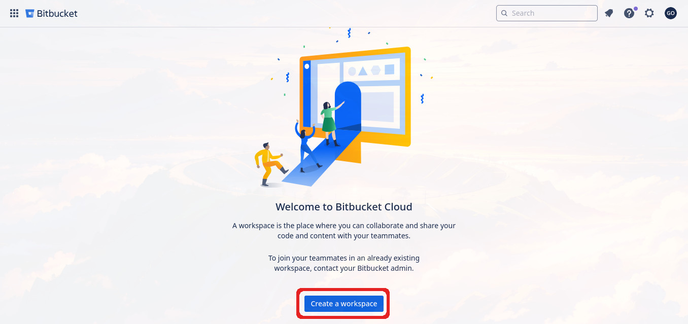

Una vez que comiences con el proceso de creación del workspace, vas a tener que seleccionar un nombre. Aquí tienes completa libertad de poner el nombre que quieras, recordando que este será tu workspace personal para trabajar, pero que otros podrán ver el nombre.

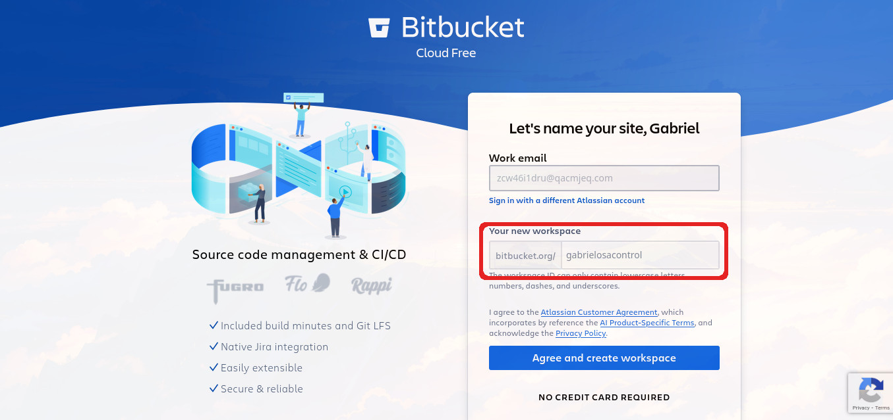

Una vez seleccionado el nombre, debes pulsar el botón para poder crear tu workspace. Esto tomará un tiempo y la aparición del workspace en tu cuenta puede no ser inmediata, por lo tanto, espera unos minutos y, si demora demasiado puedes probar refrescando la página.

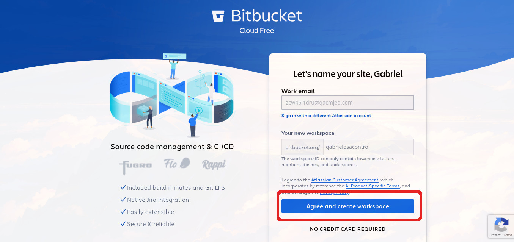

Con esto, tu cuenta de Bitbucket debería estar lista para trabajar y con un workspace personal vacío. Como último paso, debes solicitar que te otorguen acceso al workspace oficial de OSA. Es muy importante que solo solicites el acceso luego de tener tu workspace personal creado, ya que, de otra manera, el proceso será mucho más engorroso.
<p align="right">(<a href="#readme-top">back to top</a>)</p>

<a id="ssh"></a>
### Configuración de ssh 

Uno de los protocolos más usados a la hora de cifrar información para mayor seguridad, en este caso en concreto, es el método principal de autenticación que usa Bitbucket para permitir push y pull de código de un repositorio.

Dado lo anterior, va a ser necesario que configures tus llaves SSH en tu cuenta de Bitbucket. Si no tienes una llave ya creada, puedes crear una ejecutando el siguiente comando:

```sh
ssh-keygen
```

Te va a pedir varios datos, los cuales, en general, puedes dejar por defecto solo dando enter. Sin embargo, cuando se te pida ingresar una contraseña, es importante que ingreses una que luego recuerdes, ya que te será pedida cada vez que te comuniques con Bitbucket.

Luego de seguir las instrucciones, anda a la carpeta donde se guardaron los archivos, busca el que sea `<nombre_de_llave>.pub`, ábrelo y copia todo el contenido del archivo.

Abre tu cuenta de Bitbucket, entra a configuraciones e ingresa a las *Personal Bitbucket settings*.

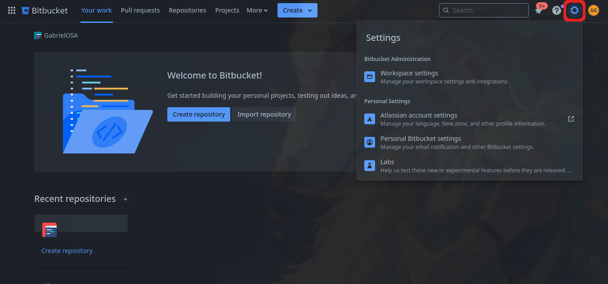
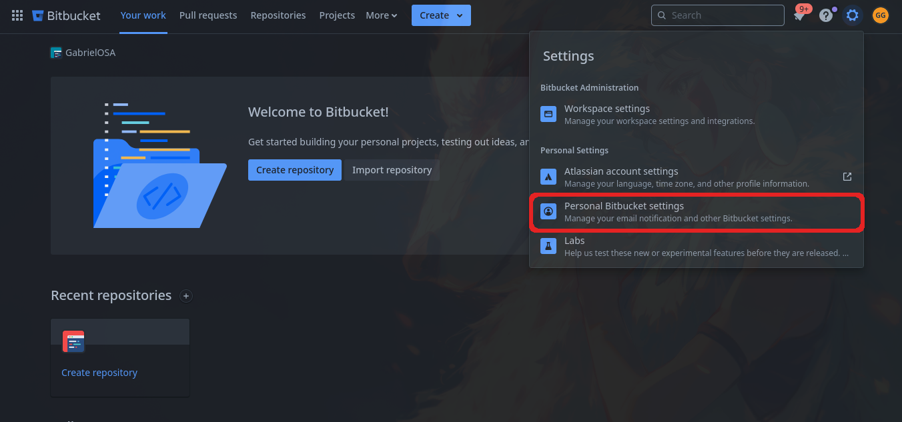

Dirígete a la sección *SSH keys* y pulsa *Add key*.

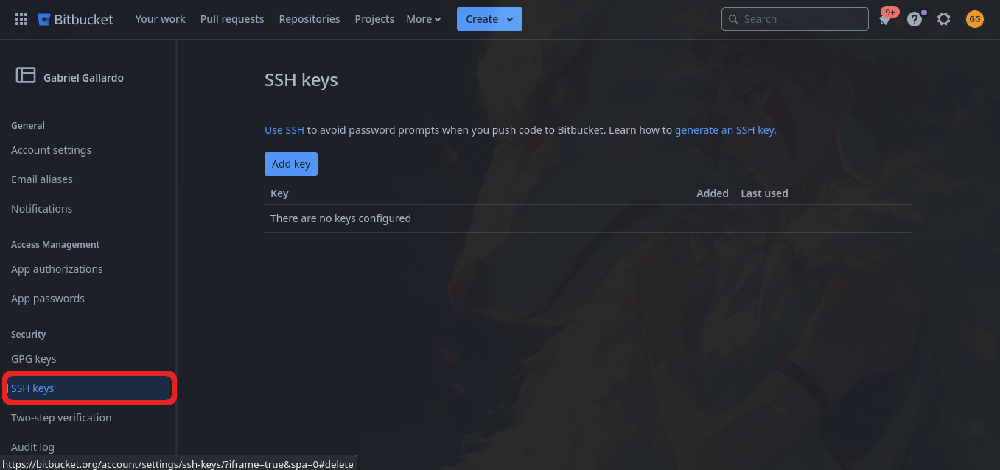
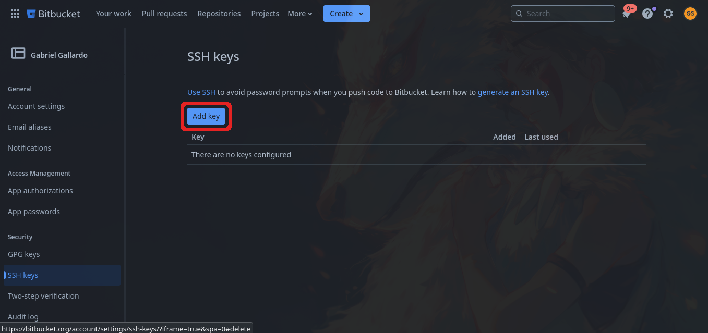

Agrégale un nombre en donde se pone una etiqueta, pega el contenido del archivo `.pub` en donde va la llave y para finalizar pulsa en *Add key*.

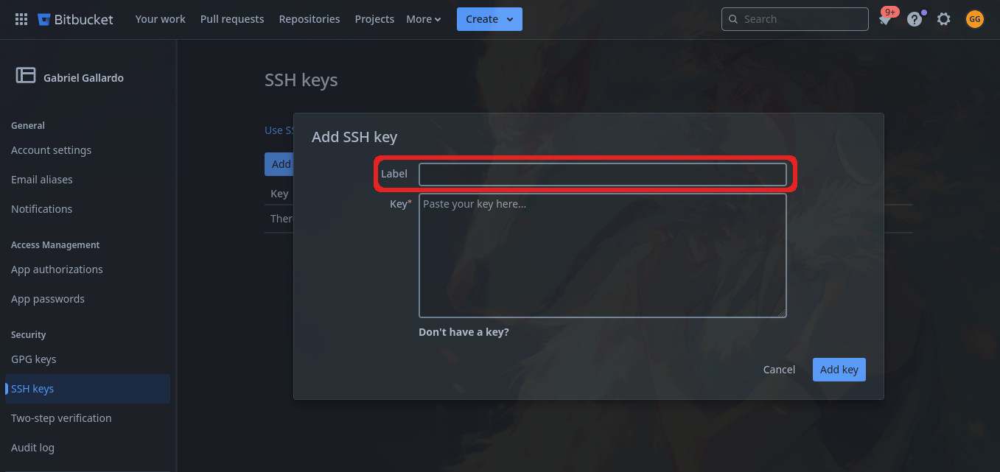
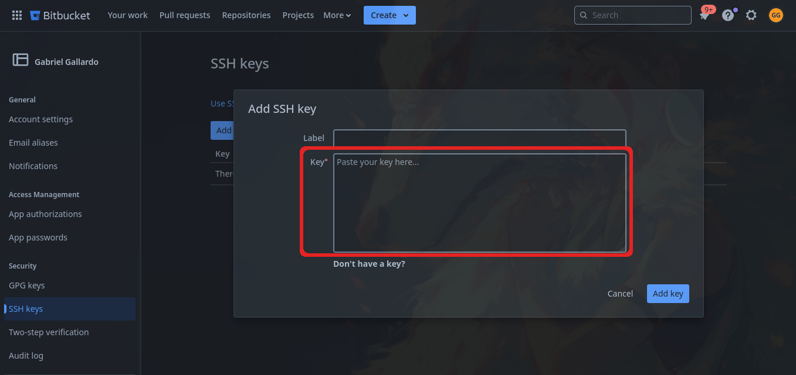
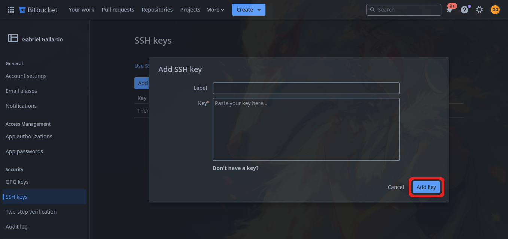

Con esto, tu llave ya está creada y agregada a tu cuenta de Bitbucket para poder autenticar.
<p align="right">(<a href="#readme-top">back to top</a>)</p>

<a id="installation"></a>
### Instalación
1. Hacer un fork del repo en bitbucket ocupando tu workspace personal

2. Clonar el repo
   ```sh
    git clone <link-del-fork>
   ```
3. Entrar a la carpeta del proyecto
4. Hacer el build de los contenedores de docker
   ```sh
    docker compose build
   ```
5. Crear un archivo .env en la carpeta del proyecto y
setear las <a href="#readme-env">Configuración inicial</a>

6. Correr los contenedores de docker
   ```sh
   docker compose up -d
   ```
7. Entrar a la carpeta dummy_data
  
8. Revisar el nombre del contenedor que tiene la base de datos
   ```sh
   docker ps --filter name=mongo
   ```
9. Corre el script de carga de datos entregándole el nombre del contenedor
   ```sh
   ./dataLoad.sh <nombre-del-contenedor>
   ```
<p align="right">(<a href="#readme-top">back to top</a>)</p>

<a id="git"></a>
### Configuración de git

En OSA se ocupa un flujo de trabajo basado en forks y pull requests. Por lo tanto, cada desarrollador trabaja en su propio fork para luego hacer PR (pull request) de su trabajo al repositorio original.

Por lo anterior, siempre se trabajará con dos referencias remotas: la del repositorio principal, que servirá para mantener el código actualizado con lo último subido, y la del fork personal, que servirá para subir nuestro código a la nube.

Para trabajar con dos referencias, hay dos métodos principales:

1. **Crear un nuevo remote**

    Con esto tendremos un remote para cada repositorio. Suponiendo que clonamos nuestro repositorio y no el principal, entonces el remote `origin` contendrá la referencia a nuestro repositorio.

    Para crear el nuevo remote, ocupamos el siguiente comando:

    ```bash
    git remote add mainOrigin <link_del_repo_principal>
    ```

    Con esto podemos comenzar a operar con el siguiente comando para trabajar:

    ```bash
    git push/pull <nombre_remote>
    ```

    Adicionalmente, se pueden cambiar los upstream para mayor comodidad al trabajar.

2. **Cambiar la URL de push**

    Con esto lo que buscamos es mantener un solo remote que pueda traer los cambios desde el repositorio principal, pero que todos los push los haga hacia el repositorio personal.

    Para esto, empezamos seteando la URL principal del remote para que ocupe el repositorio principal. Este paso puede ser evitado si se clona el proyecto directo desde el principal.

    ```bash
    git remote set-url origin <url_del_repo_principal>
    ```

    Luego cambiamos solo la URL para push, con el siguiente comando:

    ```bash
    git remote set-url --push origin <url_del_repo_fork>
    ```

    Con esta configuración, cada vez que se use `git push`, el código será enviado hacia el repositorio fork, y cada vez que se haga `git pull`, el contenido será traído desde el repositorio principal.

    Esto no evita poder crear remotes hacia otros repositorios ocupando el caso 1.
<p align="right">(<a href="#readme-top">back to top</a>)</p>


<a id="readme-env"></a>
### Configuración del .env

A continuación se detallan las variables que debe de tener el .env, sus significados y sus posibles valores por defecto.

#### Configuración base

* SECRET_KEY  
  Es la llave que se ocupa para encriptar las contraseñas de los usuarios, por ende, si se estan ocupando los datos de prueba de la base de datos, entonces se sugiere ocupar el siguiente valor por defecto:
   ```sh
    SECRET_KEY=m9nqdK2tLv3pr9Vu7h4AAE3f68m4Eyy0
   ```
  
* ENV  
  Setea el ambiente
   ```sh
    ENV=development
   ```

* PORT  
  Setea el puerto para el frontend
   ```sh
    PORT=3030
   ```
* SITE_URL  
  Setea la url para el sitio
   ```sh
    SITE_URL=http://localhost:3030
   ```

#### Configuración de externos

A contiuación se detallan las variables de ambiente para trabajar con recursos externos al codigo fuente, estas no tienen un valor por defecto a usar.

* S3  
   ```sh
    S3_BUCKET=
    S3_KEY=
    S3_SECRET=
    S3_REGION=
   ```
* AWS  
   ```sh
    AWS_SECRET_ACCESS_KEY=
    AWS_REGION=
    AWS_ACCESS_KEY_ID=
   ```
* PUSHER  
   ```sh
    PUHSER_SECRET_KEY=
    PUSHER_INSTANCE_ID=
   ```

* SENTRY  
   ```sh
    SENTRY_DNS=
   ```
* SES  
   ```sh
    SES_REGION=
   ```

<p align="right">(<a href="#readme-top">back to top</a>)</p>

<a id="usage"></a>
## Como usar

En esta sección se explica brevemente como ocupar la aplicación.

<a id="open"></a>
### Como abrir la aplicación

Luego de tener corriendo toda la aplicación con lo visto en la sección pasada. Se debe ingresar a la aplicación por medio del navegador, entrando al [localhost:3030](http://localhost:3030/).

Entrando lo primero que veremos será el login, si configuramos correctamente el .env y subimos los datos de prueba a la base de datos, entonces podremos usar cualquiera de los usuarios que se detallan en la siguiente sección y entrar a la aplicación.
<p align="right">(<a href="#readme-top">back to top</a>)</p>

<a id="user"></a>
### Usuarios disponibles por defecto
A continuación se detallan los usuarios creados por defecto en la base de datos. Todos los usuarios tienen distintas cantidades de información, sin embargo, el usuario que tiene acceso a la información más completa y compleja es el que está marcado con una ```x``` en ```most_populated```.

| email                      | password | venue    | company                          | team  | most_populated |
| -------------------------- | -------- | -------- | -------------------------------- | ----- | -------------- |
| Garrett_Heller93@gmail.com | tenavero | MAGENTA  | POTATOES SALAD                   | whale |                |
| Dan.Schowalter11@yahoo.com | waqotale | GOLD     | WARD'S SPECIAL BLUE SWIMMER CRAB | whale |                |
| Marsha_Tromp@hotmail.com   | sememixo | LAVENDER | BUNNY CHOW                       | whale | x              |

<p align="right">(<a href="#readme-top">back to top</a>)</p>

<a id="upload"></a>
### Como subir código

Como ya se ha mencionado antes, OSA ocupa un flujo de trabajo de fork y pull request. Por lo mismo, la mayor parte del tiempo de trabajo se pasará en el repositorio fork personal creado durante el onboarding.

Se espera que, dentro del repositorio personal, se trabaje usando la metodología de Gitflow, y se da por hecho en el siguiente flujo presentado. Para publicar código, se deberían seguir los siguientes pasos:

1.  Clonar el repositorio y configurarlo para usar el repositorio fork para almacenar el código.

2.  Actualizar `develop` con el repositorio principal antes de empezar a trabajar.

3.  Comenzar a trabajar ocupando Gitflow.

4.  Al terminar el proceso de trabajo, actualizar `develop` nuevamente con el repositorio principal y mergearlo con las ramas que se quieran enviar al repositorio principal.

5.  En Bitbucket, realizar un PR (pull request) desde la rama `develop` de nuestro repositorio fork a la rama `develop` del repositorio principal.

A continuación, se presenta un diagrama de flujo que representa lo antes descrito como ayuda visual.

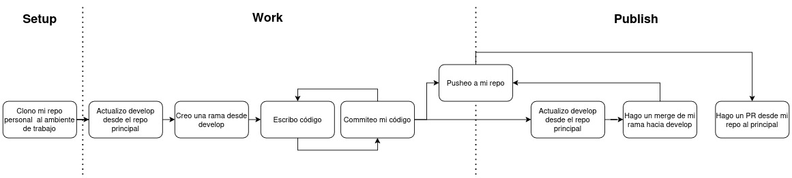
<p align="right">(<a href="#readme-top">back to top</a>)</p>

<a id="feedback"></a>
### Proceso de revisión 

Una vez que un PR es enviado a `develop`, comienza el proceso de revisión. Inicialmente, otro miembro del equipo revisará el PR y aprobará o rechazará, pidiendo mejoras según sea necesario.

Cuando un PR es aprobado y pasa a `develop`, entra en *stage*, el cual es un ambiente igual al de producción, pero para uso interno del equipo y de los QA. En este ambiente es donde se realizan todos los testeos de calidad en búsqueda de bugs.

Periódicamente se hacen PR desde `develop` a `master` en el repositorio principal. Cuando estos son hechos y aprobados, se pasa el código a producción para uso de los clientes.

La mayor parte del proceso está automatizado; por ende, una vez que cae código nuevo a `develop` o `master`, se hacen los *rebuilds* y se cargan las nuevas *features* en el ambiente correspondiente.
<p align="right">(<a href="#readme-top">back to top</a>)</p>

<a id="makefile"></a>
### Makefile

Este Makefile facilita el desarrollo al automatizar tareas comunes relacionadas con la configuración de repositorios, dependencias y servicios. A continuación, se detallan las recetas disponibles:

**Limpieza:**

* **`make cleanMongo`:** Elimina los volúmenes del servicio MongoDB en Docker.
* **`make cleanRedis`:** Elimina el volumen del servicio Redis en Docker.
* **`make cleanBackend`:** Elimina el volumen del servicio backend en Docker.
* **`make clean`:** Limpia todos los volúmenes de los contenedores, eliminando la información almacenada.

**Construcción:**

* **`make build`:** Reconstruye todos los servicios sin usar caché. Si el archivo `package.json` ha cambiado, limpia el volumen del servicio backend.

**Gestión de Servicios:**

* **`make startMongo`:** Inicia el servicio MongoDB en modo desacoplado, asegurándose de que esté detenido previamente.
* **`make startRedis`:** Inicia el servicio Redis en modo desacoplado, asegurándose de que esté detenido previamente.
* **`make startBackend`:** Inicia el servicio backend en modo desacoplado, asegurándose de que esté detenido previamente.
* **`make startFrontend`:** Inicia el servicio frontend en modo desacoplado, asegurándose de que esté detenido previamente.
* **`make start`:** Inicia todos los servicios en modo desacoplado, asegurándose de que estén detenidos previamente.
* **`make stop`:** Detiene todos los servicios en ejecución.

**Logs:**

* **`make logsBackend`:** Muestra los logs del backend en la terminal, eliminando las etiquetas de Docker para una mejor legibilidad.
* **`make logsFrontend`:** Muestra los logs del frontend en la terminal, eliminando las etiquetas de Docker para una mejor legibilidad.
* **`make logs`:** Muestra los logs del backend y frontend en la terminal.
* **`typescriptCheck`:** Muestra los logs de la compilación del código en ts.

**Utilidades:**

* **`make dumpLoad`:** Inicia el servicio MongoDB y carga los datos desde la carpeta `dump` a la base de datos.
* **`make gitRemote`:** Solicita las URLs SSH para configurar los repositorios remotos de Git.
* **`make workflow`:** Ejecuta las recetas `gitRemote` y `dumpLoad` en secuencia.

**Nota:** Para más información sobre la configuración de Git, consulta la segunda opción en la sección <a href="#git">"Configuración de git"</a>.
<p align="right">(<a href="#readme-top">back to top</a>)</p>
